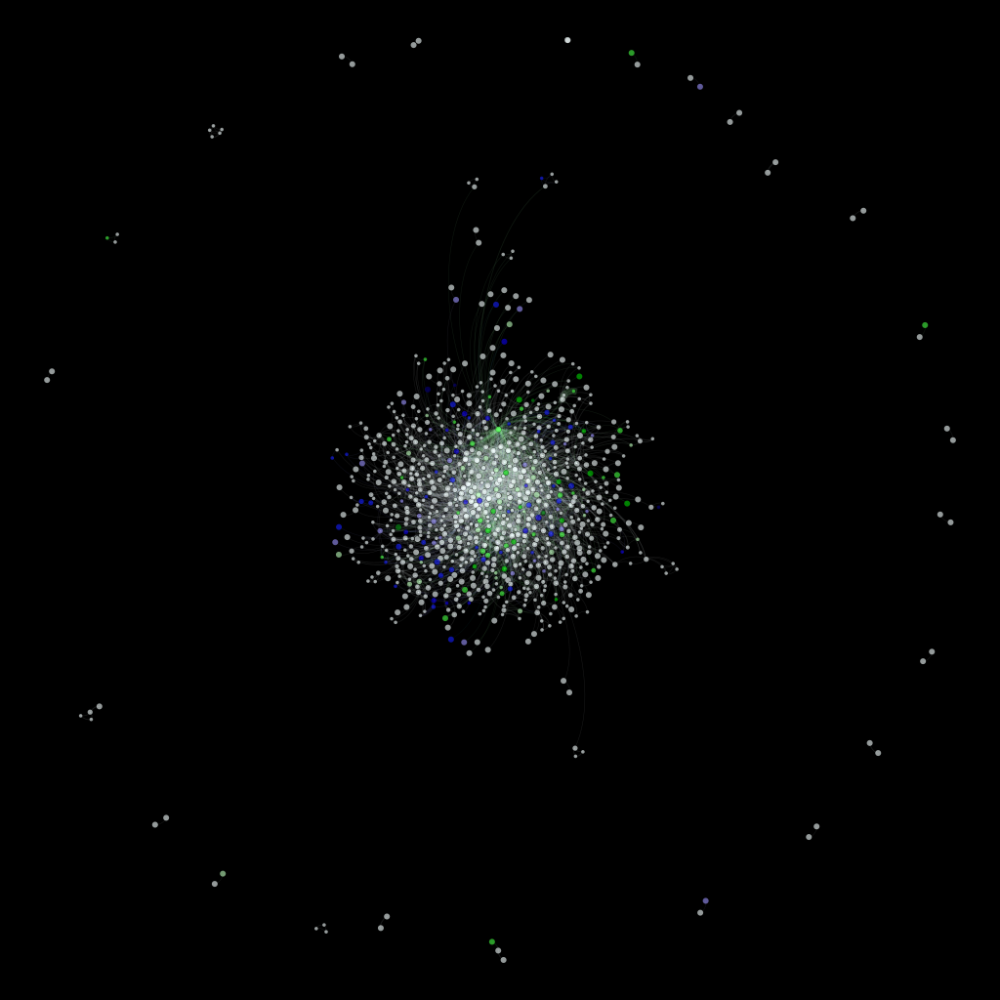

```{r setup, include=FALSE}
options(htmltools.dir.version = FALSE)
```
```{r xaringan-themer, include=F, warnings=F}
library(xaringanthemer)

style_mono_accent(
  base_color = "#9b0a7d",
  header_font_google = google_font("Overpass"),
  text_font_google   = google_font("Noto Sans", "300", "300i"),
  code_font_google   = google_font("Fira Mono")
)
```


```{r xaringan-logo, echo=FALSE}
xaringanExtra::use_logo(
image_url = "logo.png" ,
width = "180px",
height = "60px",
position = xaringanExtra::css_position(top="0em", right="0em"))
```


# Gliederung

- Basics: Graphen, Knoten, Kanten
- Beispiel Wortnetzwerke
- Beispiel Geodaten
- Beispiel Soziale Netzwerke
- Beispiel Hyperlinks


---


# Was ist ein Graph?


```{r, echo=FALSE,message=F, warning=F,fig.retina=3, fig.height=5, fig.width=15}
library(igraph)

g1 <- graph(edges=c("Knoten A", "Knoten B",   "Knoten B", "Knoten C"), n = 2, directed=F)
layout <- layout_nicely(g1)
plot(g1, layout=layout, vertex.size=70, edge.width=10, label.cex=150)

```

- **Netwerk**: Graph
- **Verbindungen**: Kanten (Edges)
- **Kreise**: Knoten (Nodes/Vertex)


---

# Graphen = Tabellen

- Tabelle und Graph sind äquivalent!
- Das eine kann in das andere überführt werden


.pull-left[


```{r, echo=FALSE,message=F, warning=F,fig.retina=3}
library(igraph)

g1 <- graph(edges=c("Knoten A", "Knoten B",   "Knoten B", "Knoten C", "Knoten D", "Knoten B"), n = 3, directed=F)
layout <- layout_nicely(g1)
plot(g1, layout=layout, vertex.size=70, edge.width=10, label.cex=150)

```
]


.pull-right[


| Node From|    Node To     |
|----------|:-------------:|
| A |  B |
| B |    C   |
| B | D |


]


---
class: center
### Star

```{r, echo=F,fig.retina=3}

st <- make_star(40)

plot(st, vertex.size=10, vertex.label=NA) 


```


---
class: center

### Tree
```{r, echo=F,fig.retina=3}

tr <- make_tree(40, children = 3, mode = "undirected")

plot(tr, vertex.size=10, vertex.label=NA) 


```


---
class: center

### Small World
```{r, echo=F,fig.retina=3}

sw <- sample_smallworld(dim=2, size=10, nei=1, p=0.1)

plot(sw, vertex.size=6, vertex.label=NA, layout=layout_in_circle)


```

---
class: center
### Tree (directed)
```{r, echo=F,fig.retina=3}

tr <- make_tree(40,children=3, mode = "out")

plot(tr, vertex.size=10, vertex.label=NA, arrow.size=.01) 


```


---
class: inverse, center

# Beispiel:
### Wortnetzwerke


---

# Warum Wortanalyse?

Wir möchten Fließtexte natürlicher Sprache analysieren, beispielsweise:

- Freitextantworten in Fragebüchern
- Social Media
- Hausaufgaben
- Prosa
- ...

---

# Wie analysieren?

- Einfach lesen, Meinung bilden
  + Problem: Qualitativ, bei großer Menge schwierig, Verzerrungstendenzen
- Content-Rating
  + Besser: Weniger subjektiv
  + Problem: mehrere Personen, Widersprüche, Schulungen, Ratinginstrumente
- Worthäufigkeiten:
  + Besser: relativ leicht auszuwerten
  + Problem: Wörter funktionieren immer nur in ihrem semantischem Kontext, keine Information über Struktur des Textes
  
  
<br><br>
.center[
.pull-left[
*Komm', wir essen Opa.*
]


.pull-right[
*Komm' wir essen, Opa.*
]

]

---

# Graph Theorie

- Wir brauchen eine Methode, mit der wir Wörter und ihre Organisation im Kontext zueinander betrachten können
  + Möglichkeit für quantitative Schlüsse?
- Graph Theorie als Lösung:
  + Vertices: Wörter
  + Edges: Wörter werden zusammen genannt

---
# Schritt 1: Vorbereitung


.pull-left[
>Yannik backt gerne Kuchen.
>
>Max isst gerne Kuchen.
>
>Kuchen kann Yannik beim Bäcker kaufen.

]

.pull-right[
- wir brauchen wieder Groß- und Kleinschreibung, Satzzeichen, inhaltlich unbedeutende Wörter
- Rausschmeißen!
]


---

# Schritt 1: Vorbereitung


.pull-left[
>yannik backt ~~gerne~~ kuchen
>
>max isst ~~gerne~~ kuchen
>
>kuchen ~~kann~~ yannik ~~beim~~ bäcker kaufen

]

.pull-right[
- Wörter via bspw. ISO-Norm identifizieren
]


---


# Schritt 2: Edge-Table erstellen


.pull-left[
>**yannik** *backt* kuchen
]

.pull-right[
| Node From|    Node To     |    Weight     |
|----------|:-------------:|:-------------:|
| yannik |  backt |   1    |
]


---

# Schritt 2: Edge-Table erstellen


.pull-left[
>**yannik** backt *kuchen*
]

.pull-right[
| Node From|    Node To     |    Weight     |
|----------|:-------------:|:-------------:|
| yannik |  backt |   1    |
| yannik | kuchen |   1    |
]


---

# Schritt 2: Edge-Table erstellen


.pull-left[
>~~yannik~~ **backt** *kuchen*
]

.pull-right[

| Node From|    Node To     |    Weight     |
|----------|:-------------:|:-------------:|
| yannik |  backt |   1    |
| yannik | kuchen |   1    |
| backt  | kuchen |    1   |

]


---

# Schritt 2: Edge-Table erstellen


| Node From|    Node To     |    Weight     |
|----------|:-------------:|:-------------:|
| yannik |  backt |   1    |
| yannik | kuchen |   **2**    |
| backt  | kuchen |    1   |
| max  | isst |    1   |
| max  | kuchen |    1   |
| isst  | kuchen |    1   |
| kuchen  | bäcker |    1   |
| ...  | ... |    ...   |

- **Wenn eine Verbindung doppelt vorkommt Weight um 1 erhöhen!**

---

# Schritt 3: Auswertung


Zwei Möglichkeiten:
- Graphische Auswertung: Deskriptiv
- Numerische Auswertung: Quantitativ


---

# Graphische Auswertung

- Layout-Algorithmen


- Bspw. Fruchtman-Reingold, Force-Atlas...

---
class: center

# Graphische Auswertung:

```{r, echo=FALSE,message=F, warning=F,fig.retina=3}

df <- data.frame(
  from = c("yannik", "yannik", "yannik", "yannik", "kaufen", "kaufen", "bäcker", "kuchen", "kuchen", "kuchen", "max"),
  to = c("backt", "kuchen", "kaufen", "bäcker", "bäcker", "kuchen", "kuchen", "backt", "max", "isst", "isst"),
  weight = c(1, 2, 1, 1, 1, 1, 1, 1, 1, 1, 1)
)
g1 <- graph_from_data_frame(df, directed=F)

layout <- layout_with_fr(g1)
plot(g1, layout=layout, vertex.size=20, edge.width=2, label.cex=150)

```

---

# Numerische Auswertung


- **Mittlere Pfadlänge:** 1.476
  + Wie viele Schritte brauche ich im Schnitt, um von A zu B zu kommen
- **Durchschnittlicher Clustering Coefficient:** 0.857
  + Wie stark sind meine Knoten vernetzt?
  
---

# Numerische Auswertung


- Viele weitere Kennwerte
- die meisten davon erst aussagekräftig, wenn verglichen mit Kennwerten anderer Netzwerke
- Können auch nur für einzelne Knoten berechnet werden


---
class: center, inverse

# Beispiel: Songlyrics


---
class: center


---
# Datensatz

- [🢅 Datensatz](https://www.kaggle.com/datasets/PromptCloudHQ/taylor-swift-song-lyrics-from-all-the-albums) von Song-Lyrics von Taylor Swift für alle Alben bis 2017
- Vorgehen analog wie Beispiel vorher
- Vorverarbeitung mit R, Layouting mit [🢅 Gephi](https://gephi.org/)
- Zusätzlich: Für jedes Wort Sentiment-Analyse
  + auf einer Skala von -5 bis +5 Negativität/Positivität des Wortes


---
# Layouting

```{r, echo=F}
knitr::include_url("https://cloud.rz.uni-kiel.de/index.php/s/WeaeNPkZ4HzGDDL")
```


---
class: bgblack, center

# Gesamtnetzwerk

```{r, out.width = "450px", echo=F}

```

---
class: bgblack, center
# Gesamtnetzwerk
```{r, out.width = "600px", echo=F}
knitr::include_graphics("pics/core_network.png")
```

---
class: bgblack, center
# Gesamtnetzwerk
```{r, out.width = "300px", echo=F}
knitr::include_graphics("pics/outside_hub.png")
```

```{r, out.width = "300px", echo=F}
knitr::include_graphics("pics/hub2.png")
```


---
class: bgblack, center

#Vergleich

```{r, echo=F}

```


---
#Vergleich

```{r, echo=F, warning=F, message=F}
# look here for info on how the analysis was done
source("taylor_swift/analyze_indices.R")
```


```{r, echo=F, fig.retina=3}
ggplot(dat, aes(x = album, y = Verkauft, fill=CC)) + geom_col() + 
  theme_bw() + scale_fill_gradient(low="blue", high="red") +
  labs(y="Sales in Billion", x="Album (Chronologically)")
```
---
#Takeaway

- wenn sie erfolgreich mit ihrer Musik sein wollen, machen sie ihre Texte nicht zu komplex - die Leute mögen das nicht!

- Wichtige Limitationen:
  + Spotify Streams
  + kleine Effektstärke
  + ...

---
# Weitere mögliche Anwendungen

- Tagebücher
- Hausaufgaben
- Therapieanträge
- Fachtexte
- ...


---
class: inverse, center
# Beispiel 2: Maps-Data


---
# Maps Data

- Google Maps Daten von April 2020 und Febuar 2022
- sehr ausführliche aber auch intransparente Daten
- Orte: Knoten
- Bewegung zwischen Orten: Kanten


---
class: center

# Daten


---
class: center

# Daten


---

class: center

# Daten


---
# Auswertung

- finale Daten die verwendet wurden:
  + Location Stamps ("Place Visited")
  + es wird angenommen, das zwischen den Orten sich von Ort A zu B bewegt wurde (Kante)
  + kann nicht ganz hinkommen, lässt sich aber leicht aus den Daten extrahieren

- Vorgehen ansonsten analog zu vorherigem
  + Edges sind diesmal directed
  + kein Einbezug von Gewichten


---
class: center
# 2022

```{r, echo=F, message=F, warning=F, fig.retina=3}
source("googlemaps/prep_gmaps_data_2022.R")


base_plot <- ggmap(map)
base_plot +   geom_line(data=pivot_data, aes(group=move_id, x=long_from, y= lat_from), alpha=.15, size=1.2) +
  geom_point(
    data=pivot_data,
    aes(x=long_from, y=lat_from),
    size=2,
    color="darkred",
    alpha=.3
  )   + labs(x="Breitengrad", y="Längengrad")

```


---
class: center

# 2022

```{r, echo=F, warning=F, message=F, fig.retina=3}
plot(igraph_2022,layout=co, edge.arrow.size=.2,
      vertex.label.cex = .6, vertex.label=NA)
```
- Layout mit FR


---
class: center
# 2020

```{r, echo=F, message=F, warning=F, fig.retina=3}
source("googlemaps/prep_gmaps_data_2020.R")


base_plot <- ggmap(map)
base_plot +   geom_line(data=pivot_data, aes(group=move_id, x=long_from, y= lat_from), alpha=.15, size=1.2) +
  geom_point(
    data=pivot_data,
    aes(x=long_from, y=lat_from),
    size=2,
    color="darkred",
    alpha=.3
  )   + labs(x="Breitengrad", y="Längengrad")

```


---
class: center

# 2022

```{r, echo=F, warning=F, message=F, fig.retina=3}
plot(igraph_2020,layout=co, edge.arrow.size=.2,
      vertex.label.cex = .6, vertex.label=NA)
```
- Layout mit FR


---

# Vergleich

```{r, echo=F, message=F, warning=F}

cc_2020 <- transitivity(igraph_2020)
cc_2022 <- transitivity(igraph_2022)
mmp_2020 <- mean_distance(igraph_2020)
mmp_2022 <- mean_distance(igraph_2022)
mean_degree_2020 <- mean(degree(igraph_2020))

mean_degree_2022 <- mean(degree(igraph_2022))

dat <- data.frame(Dataset = c("2020", "2022"),
                  CC = round(c(cc_2020, cc_2022),2),
                  MMP = round(c(mmp_2020, mmp_2022),2),
                  MD = round(c(mean_degree_2020, mean_degree_2022),2))

knitr::kable(dat)

```

- *CC*: Clustering Coefficient
- *MMP*: Mean Minimum Path Length
- *MD*: Mean Degree


---
# Anwendung

.center[
```{r, echo=F,fig.retina=3}

tr <- make_tree(20, children = 3, mode = "undirected")

plot(tr, vertex.size=10, vertex.label=NA) 


```
]

- Graphen von Patient:innen?
- Wie verändern die sich?
- Und was müssen wir Patient:innen dann eigentlich raten?


---
class: inverse, center

# Beispiel: Sozialkontakte


---
# Sozialkontakte als Graph

.center[
```{r, echo=F, message=F, warning=F, fig.retina=3}

g1 <- graph(edges = c("John", "Jack", "Laura", "Jack", "Klaas", "Laura", "Klaas", "John", "Mika", "John", "Mika", "Jack", "Klaas", "Sia", "Jack", "Emily"),n=8, directed=F)

layout <- layout_with_fr(g1)
plot(g1, layout=layout, vertex.size=20, edge.width=2, label.cex=150)

```

]


---
# Beispiel: Rating von Sozialumfeld

- Frage: Wen haben Sie letzte Woche alles getroffen?
  + alle auflisten
  + sich selber mit in die Liste aufnehmen
- Dann für jede Doppelkombination einschätzen: Wie gut kennen Sie/die jeweiligen Personen sich?
  + Rating auf Skala von 0 (kennen sich gar nicht) zu 7 (wie Familie)
  + am Ende alle Edges mit 0 aus dem Datensatz filtern
- Dann automatisch Knoten (Leute/ich) und Kanten mit Gewichten (Rating)


---
# Daten

- mit reduzierten Daten durchgeführt
  + Ratings explodieren!
  + "Nur" 12 Kontakte = über 60 Ratings


---
# Network

```{r, echo=F, message=F, warning=F, fig.retina=3}
source("social/analyze_social.R")
```


---
# Anwendung

.center[
```{r, echo=F,fig.retina=3}

tr <- make_tree(30, children = 3, mode = "undirected")

plot(tr, vertex.size=10, vertex.label=NA) 


```
]

- Wie sehen Netzwerke von Patient:innen aus mit:
  + Depression?
  + Angststörungen?
- Was müssen wir Patient:innen dann eigentlich raten?
- und gibt es ein Zuviel?
- Was passiert wenn mir nicht zentral in diesem Netzwerk liegen?


---
class: inverse, center

#Beispiel 4: Hyperlinks in Wikiepdia


---
# Hyperlinks

- Internetseiten verlinken aufeinander
- verstehen wir Internetseiten als Knoten, dann können wir Links als Kanten in Netzwerken verstehen!
- Wikipedia als Spiegel von
  + öffentlichen Wissen über psychische Störungen
  + Wahrgenommene "Relevanz" von psychischen Störungen in der Öffentlichkeit?

---
# Datensatz
- Jeweils der Wikipedia-Artikel von "Depression" und "Angststörung" gecrawlt
- Alle Links auf andere Wikipedia-Artikel gesammelt
  + Knotenverbindungen in der Node-Tabelle!
- Alle diese Links nochmal gecrawlt, wenn der Subartikel auf einen anderen Subartikel verlinkt (der bereits in der Tabelle war), dann wird diese Verlinkung zwischen den beiden Artikeln aufgenommen
  + also nur eine Ebene "tief"


---
# Beispiel

```{r, echo=F, message=F, warning=F}
source("wikipedia/analyze_wiki.R")

dat <- as.data.frame(depression_data)
dat$from <- dat$from %>% str_replace("^https://de.wikipedia.org", "")
dat$to <- dat$to %>% str_replace("^https://de.wikipedia.org", "")

knitr::kable(head(dat))
```


---
class: center, bgblack
# Graphen

.pull-left[
```{r, out.width = "400px", echo=F}

```
]

.pull-right[
```{r, out.width = "400px", echo=F}

```
]


---
# Numerischer Vegleich

```{r, echo=F, warning=F, message=F}

igraph_depression <- graph_from_data_frame(depression_data)
igraph_anxiety <- graph_from_data_frame(anxiety_data)

cc_igraph_depression <- transitivity(igraph_depression)
cc_igraph_anxiety <- transitivity(igraph_anxiety)
mmp_igraph_depression <- mean_distance(igraph_depression)
mmp_igraph_anxiety <- mean_distance(igraph_anxiety)
mean_degree_igraph_anxiety <- mean(degree(igraph_anxiety))

mean_degree_igraph_depression <- mean(degree(igraph_depression))

dat <- data.frame(Dataset = c("Depression", "Angststörungen"),
                  CC = round(c(cc_igraph_depression, cc_igraph_anxiety),2),
                  MMP = round(c(mmp_igraph_depression, mmp_igraph_anxiety),2),
                  MD = round(c(mean_degree_igraph_depression, mean_degree_igraph_anxiety),2))

knitr::kable(dat)

```


---
class: inverse, center

# Fragen?


---
class: inverse, center

# Danke für die Aufmerksamkeit!